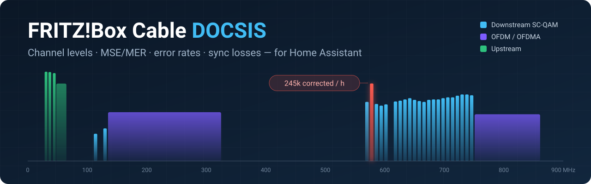

<p align="center">
  
</p>

<p align="center">
  <a href="https://hacs.xyz"></a>
  <a href="https://github.com/stephanseitz/ha-fritzbox-docsis/releases"></a>
  <a href="https://github.com/stephanseitz/ha-fritzbox-docsis/actions/workflows/validate.yml"></a>
  <a href="https://github.com/stephanseitz/ha-fritzbox-docsis/actions/workflows/tests.yml"></a>
  
  <a href="LICENSE"></a>
</p>

<p align="center">
  <b>English</b> · <a href="README.de.md">Deutsch</a>
</p>

# FRITZ!Box Cable (DOCSIS) for Home Assistant

Brings the **cable information** page of a FRITZ!Box Cable (*Internet › Cable information*)
and the cable events from its **event log** into Home Assistant: per-channel power levels,
MSE/MER, correctable and uncorrectable errors, **error rates per hour**, and an event every
time the modem loses sync.

Built to answer the question every cable customer eventually asks the support hotline:
*"Why does my connection keep dropping, and can you prove it?"* With a few weeks of
history you can see which channel is noisy, when it happens, whether it correlates with
something in your house, and exactly when each resync happened.

## Contents

- [Features](#features)
- [Requirements](#requirements)
- [Installation](#installation)
- [Setup](#setup)
- [Entities](#entities)
- [Events and automations](#events-and-automations)
- [Dashboard](#dashboard)
- [Reading the values](#reading-the-values)
- [How it works](#how-it-works)
- [Troubleshooting](#troubleshooting)
- [Development](#development)

## Features

- 📶 **Every channel as its own entities**: DOCSIS 3.0 downstream (power, MSE, errors),
  DOCSIS 3.1 OFDM blocks (power, MER, errors), upstream channels and OFDMA modulation.
- 📈 **Error rates per hour** per channel and in total. Raw counters reset on every resync;
  rates do not, so trends stay readable.
- 🔎 **Worst channel** sensor that points straight at the noisy frequency, with the top 5
  as an attribute.
- 🔌 **Sync loss detection** from the FRITZ!Box event log, with the **original timestamp**,
  even if Home Assistant could not reach the box during the outage.
- ⚡ **Events** `fritzbox_docsis_sync_lost` / `fritzbox_docsis_sync_restored` and an
  event entity for the logbook and automations.
- 📊 **Long-term statistics** out of the box (`total_increasing` counters, `measurement`
  levels), ready for statistics graphs over months.
- 🧭 **Stable entity IDs**: channels are named by **frequency**, not channel ID, because
  channel IDs can change after every resync.
- 🌍 English and German UI, entity names follow your Home Assistant language.
- 🔒 Local polling only, read-only, no cloud. Diagnostics download with credentials removed.

## Requirements

| | |
|---|---|
| **FRITZ!Box** | A cable model, e.g. FRITZ!Box 6591 Cable, 6660 Cable or 6690 Cable. Other cable models with the same web interface should work too. |
| **FRITZ!OS** | 7.2x or newer. Login uses PBKDF2 (FRITZ!OS ≥ 7.24) with MD5 as fallback. |
| **Home Assistant** | 2025.2 or newer. |
| **Network** | Home Assistant must reach the FRITZ!Box web interface, either locally or via MyFRITZ!. |

## Installation

### HACS (recommended)

[](https://my.home-assistant.io/redirect/hacs_repository/?owner=stephanseitz&repository=ha-fritzbox-docsis&category=integration)

Or by hand:

1. HACS › ⋮ › **Custom repositories**
2. Repository: `https://github.com/stephanseitz/ha-fritzbox-docsis`, type **Integration**
3. Search for **FRITZ!Box Cable (DOCSIS)**, download it, and **restart Home Assistant**.

### Manual

1. Download `fritzbox_docsis.zip` from the [latest release](https://github.com/stephanseitz/ha-fritzbox-docsis/releases/latest).
2. Unpack it into `/config/custom_components/fritzbox_docsis/` so that
   `/config/custom_components/fritzbox_docsis/manifest.json` exists.
3. Restart Home Assistant.

## Setup

### 1. Create a FRITZ!Box user

In the FRITZ!Box: **System › FRITZ!Box Users › Add User**

- Name, e.g. `homeassistant`, with a long, unique password
- Enable **"FRITZ!Box Settings"**. Without this right the box does not return cable information.
- Only if you connect via MyFRITZ!: also enable **"Access from the internet allowed"**
- Disable everything else (voice messages, smart home, NAS …)

### 2. Local address or MyFRITZ!?

**Local is better**: faster, and Home Assistant can still read the box while the cable
connection is down. Use the address you open the FRITZ!Box with in your browser, e.g.
`http://192.168.178.1`. If the FRITZ!Box sits in front of another router, it is usually
the address of that router's WAN network.

**MyFRITZ!** works too, e.g. `https://xxxxxxxx.myfritz.net:44xxx`:

- Keep **"Verify SSL certificate"** enabled; the MyFRITZ! certificate is valid.
- During a cable outage the box is not reachable via MyFRITZ!, so entities are briefly
  *unavailable*. The sync loss is still recorded: once the box is back, the integration
  reads the log and fires the event with the **original time**.

### 3. Optional: test access first

`tools/fritz_docsis_check.py` needs only Python 3.10+ and no extra packages:

```bash
python tools/fritz_docsis_check.py --url http://192.168.178.1 --user homeassistant
```

It asks for the password, prints all channels as a table plus the latest cable events,
and saves the raw data to `fritz_docsis_raw.json` (without credentials). If something
looks wrong, that file is the best starting point for an issue.

### 4. Add the integration

[](https://my.home-assistant.io/redirect/config_flow_start/?domain=fritzbox_docsis)

Or **Settings › Devices & services › Add integration › FRITZ!Box Cable (DOCSIS)**.

- **URL**: e.g. `http://192.168.178.1` or your MyFRITZ! address including the port. A path
  copied from the browser such as `/#/cable/channels` is stripped automatically.
- **Username / password** from step 1.

**Options** (*Configure*):

| Option | Default | |
|---|---|---|
| Polling interval | 300 s | 60–3600 s. Each poll is two requests to the box. |
| Evaluate event log | on | Needed for sync loss detection and the connection sensors. |

If the password changes, Home Assistant asks for new credentials by itself.

## Entities

Entity IDs follow your Home Assistant language. The examples below are for **English**;
with German they look like `sensor.fritz_box_kabel_ds_578_mhz_korrigierbare_fehler_pro_stunde`.

### Device-wide

| Entity | Example ID | Notes |
|---|---|---|
| Cable connection | `binary_sensor.fritz_box_cable_cable_connection` | From the event log. Attribute `recent_events`. |
| Cable sync | `event.fritz_box_cable_cable_sync` | Event types `sync_lost`, `sync_start`, `sync_ok`. |
| Last sync loss | `sensor.fritz_box_cable_last_sync_loss` | Timestamp from the event log |
| In sync since | `sensor.fritz_box_cable_in_sync_since` | Timestamp |
| Sync losses 24 h / 7 days | `sensor.fritz_box_cable_sync_losses_24_h` | |
| Correctable / uncorrectable errors total | `sensor.fritz_box_cable_correctable_errors_total` | Counter, resets on resync |
| Correctable / uncorrectable errors per hour | `sensor.fritz_box_cable_correctable_errors_per_hour` | Rate across all downstream channels |
| Worst channel | `sensor.fritz_box_cable_worst_channel` | Channel with the highest correctable error rate. Attribute `top_channels`. |
| DS power min / max | `sensor.fritz_box_cable_ds_power_min` | dBmV |
| DS MSE worst channel | `sensor.fritz_box_cable_ds_mse_worst_channel` | dB, DOCSIS 3.0 |
| DS MER worst OFDM block | `sensor.fritz_box_cable_ds_mer_worst_ofdm_block` | dB, DOCSIS 3.1 |
| US power max | `sensor.fritz_box_cable_us_power_max` | dBmV |
| US OFDMA modulation | `sensor.fritz_box_cable_us_ofdma_modulation` | e.g. `256QAM` |
| DS / US channels | `sensor.fritz_box_cable_ds_channels` | Diagnostic |

### Per channel

Created automatically for every frequency the box reports. New frequencies appear as new
entities without a restart.

| Channel type | Entities |
|---|---|
| **Downstream DOCSIS 3.0** (`ds_578_mhz_…`) | power level, MSE, correctable errors, uncorrectable errors, correctable errors per hour, uncorrectable errors per hour *(disabled by default)* |
| **Downstream OFDM** (`ds_ofdm_751_861_mhz_…`) | power level, MER, uncorrectable errors, uncorrectable errors per hour |
| **Upstream** (`us_37_2_mhz_…`, `us_ofdma_48_65_mhz_…`) | power level |

Attributes: `docsis`, `channel_id`, `frequency_mhz`, `frequency_end_mhz` (OFDM),
`modulation`, `active_subcarriers` (OFDMA).

> [!NOTE]
> The FRITZ!Box resets all error counters on every resync and reboot. The counters have
> `state_class: total_increasing`, so Home Assistant handles the reset correctly in
> long-term statistics. Rates are *unknown* for one interval after a reset.

## Events and automations

On every new cable event from the log, the integration fires on the event bus:

| Event | When |
|---|---|
| `fritzbox_docsis_sync_lost` | "Cable internet not responding (no synchronisation)" |
| `fritzbox_docsis_sync_restored` | "Cable internet is available" |

Event data:

```yaml
kind: sync_lost                     # sync_lost | sync_ok
timestamp: "2026-10-01T23:52:28+02:00"  # time from the FRITZ!Box log
message: "Kabel-Internet antwortet nicht (Keine Synchronisierung)."
source: log                         # log, or counters if the log is disabled
```

Events are de-duplicated across Home Assistant restarts. Historic entries are not replayed
when the integration is set up for the first time.

Minimal notification:

```yaml
triggers:
  - trigger: event
    event_type: fritzbox_docsis_sync_lost
actions:
  - action: notify.notify
    data:
      title: "Cable internet: sync lost"
      message: "{{ trigger.event.data.timestamp }}: {{ trigger.event.data.message }}"
```

More in [`examples/en/automations.yaml`](examples/en/automations.yaml): sync loss, sync
restored, packet loss and upstream modulation downgrade.

## Dashboard

[`examples/en/dashboard.yaml`](examples/en/dashboard.yaml) is a complete sections dashboard
built from standard cards only: connection status, a logbook of sync events, error rates
with trend graphs, gauges with guideline colour ranges for power and MSE, and 30-day
statistics. German entity IDs: [`examples/de/dashboard.yaml`](examples/de/dashboard.yaml).

**Tip:** to hunt for interference, put the error rate of your worst channel into a
history graph next to large consumers in your home (heat pump, wallbox, PV inverter) or
the times of day the errors start.

## Reading the values

Rough guidelines for SC-QAM cable channels. Operators use their own limits, and a single
value slightly outside a range is no reason to worry; what matters is the trend.

| Value | Good | Watch | Bad |
|---|---|---|---|
| **DS power** | −2 … +12 dBmV | −6 … −2 or +12 … +18 | below −6 / above +18 |
| **DS MSE** (256QAM) | better than −33 dB (e.g. −37) | −33 … −31 dB | worse than −31 dB |
| **US power** | 35 … 49 dBmV | 49 … 51 | above 51 dBmV (modem at its limit) |
| **Correctable errors** | a few per hour | steadily rising on one channel | high rate on one channel: interference |
| **Uncorrectable errors** | 0 | occasional | continuous: packet loss |

Typical patterns:

- **One downstream channel with far more correctable errors than its neighbours** points
  to narrow-band ingress at that frequency, e.g. a broadcast or mobile signal leaking
  into poorly shielded cabling. Check cables, connectors and the wall socket first.
- **Repeated sync losses** with the upstream power near the top of its range point to
  a return path problem. Ask the operator to check the line; show them the history.
- **OFDMA modulation dropping** (e.g. from 256QAM to 64QAM) means the operator saw a
  worse return path and stepped down.

## How it works

- Logs in via `login_sid.lua?version=2` (PBKDF2, MD5 fallback) and keeps the session.
  On an expired session it logs in again transparently.
- Reads `data.lua` page `docInfo` (the JSON behind *Cable information*) and page `log`.
- Error rates are the counter delta divided by the elapsed time; a counter that went down
  marks a resync and yields *unknown* for that interval.
- Cable events are detected from the log texts (German and English FRITZ!OS texts are
  recognised). The newest seen event is stored so that nothing is reported twice.
- Without the event log, a counter reset is reported as a sync loss with
  `source: counters`.

> [!IMPORTANT]
> `data.lua` is the interface of the FRITZ!Box web UI and is **not officially documented**
> by AVM. The parser is deliberately tolerant to renamed fields, but a major FRITZ!OS
> update may still require an adjustment. Please open an issue with your diagnostics if
> values disappear after an update.

## Troubleshooting

| Problem | What to check |
|---|---|
| *Cannot reach the FRITZ!Box* | URL and port; can Home Assistant reach that network (firewall/VLAN rules)? |
| *Login failed or missing permissions* | Password; user has "FRITZ!Box Settings" (and "Access from the internet" for MyFRITZ!). |
| *Login temporarily blocked* | The box blocks logins after failed attempts. Wait a minute. |
| *No cable information found* | Not a cable model, or the user lacks "FRITZ!Box Settings". |
| Sync sensors *unavailable* | Event log evaluation is disabled in the options, or the log page is not readable. |

**Diagnostics:** *Settings › Devices & services › FRITZ!Box Cable (DOCSIS) › ⋮ › Download
diagnostics* contains all raw data with credentials removed.

**Debug log:**

```yaml
logger:
  logs:
    custom_components.fritzbox_docsis: debug
```

## Development

```bash
python -m venv .venv && . .venv/bin/activate
pip install -r requirements_test.txt
pytest              # runs against a simulated FRITZ!Box
ruff check . && ruff format --check .
```

The tests start a small fake FRITZ!Box (`tests/mock_fritzbox.py`) with realistic channel
data and cover login (PBKDF2 and MD5), session expiry, the config flow, entity creation in
English and German, rates, counter resets, sync events and their de-duplication, and that
every entity referenced in `examples/` exists. See [CONTRIBUTING.md](CONTRIBUTING.md).

## Disclaimer

This is a community project and is not affiliated with or endorsed by AVM GmbH.
FRITZ! and FRITZ!Box are trademarks of AVM GmbH.

## License

[MIT](LICENSE)
